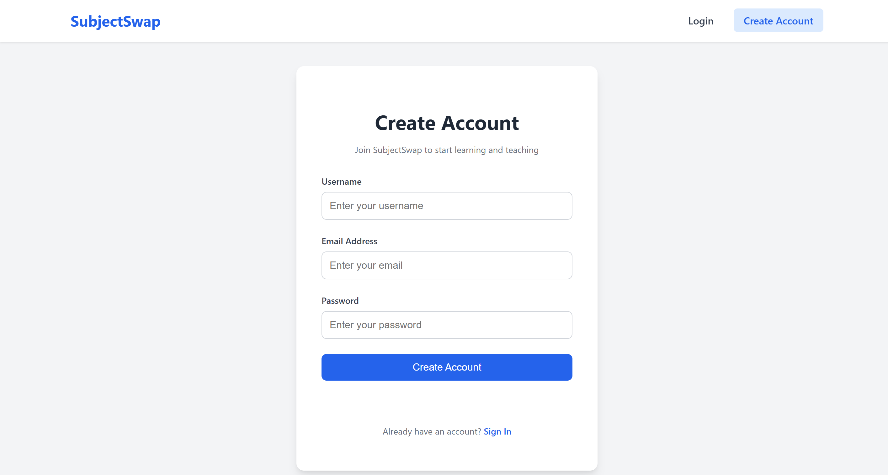
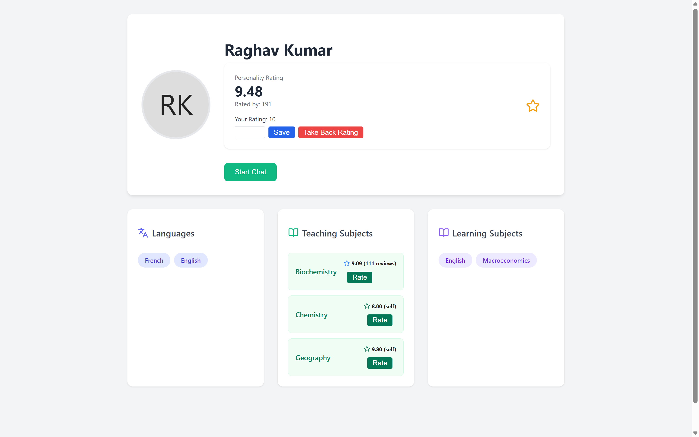
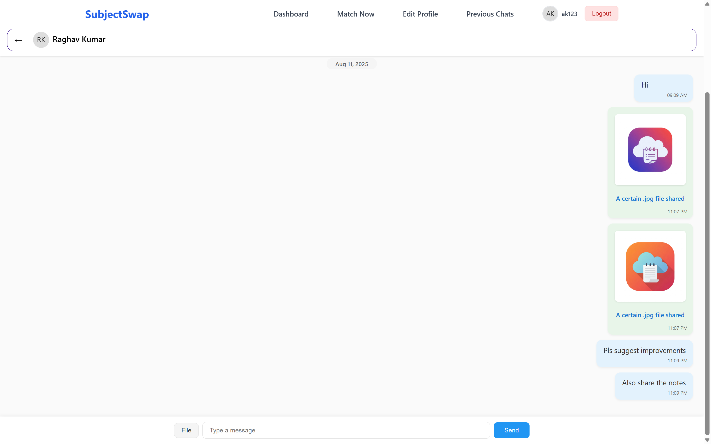

# SubjectSwap

## Description
SubjectSwap is a web application that allows students to swap their subjects with each other. The application is designed to help students who are struggling with a particular subject to find someone who is struggling with a different subject and can help them out. The application also allows students to create a profile and add their subjects of interest, so that other students can find them and swap subjects with them.

---

## Screenshots
<table>
  <tr>
    <td></td>
    <td></td>
  </tr>
  <tr>
    <td></td>
    <td></td>
  </tr>
  <tr>
    <td></td>
    <td></td>
  </tr>  
  <tr>
    <td></td>
    <td></td>
  </tr>
  <tr>
    <td></td>
    <td></td>
  </tr>
</table>

---

## Hosted URL
<a href="https://subjectswap-frontend.onrender.com/">https://subjectswap-frontend.onrender.com/</a>

---

## Features Implemented
 - Account creation and login
 - Real-Time Searching and advanced AND OR Query parameters.
 - Detailed Profile Viewing
 - Profile Management
 - Consistant Subject and Rating Management
 - Dot-Product Similarity based match-making algorithm.
 - Provisions to penalize dishonesty and those against attempts to manipulate the algorithm.
 - Encryption Tunneled Private Chat with File Upload and Preview.

---

## Frontend
Detailed View at <a href="https://github.com/SubjectSwap/FRONTEND">https://github.com/SubjectSwap/FRONTEND/ README</a>

---

## Backend
Detailed View at <a href="https://github.com/SubjectSwap/BACKEND">https://github.com/SubjectSwap/BACKEND/ README</a>

---

## Technologies/Libraries/Packages Used
- mongodb (mongoose)
- express
- react
- socket.io
- bcrypt
- jwt
- cors
- multer
- nodejs
- lucid-react (icons)
- react-router-dom
- **cloudflare**

---

## Local Setup
Instruction given in both frontend and backend repositories seperately.

## Team Members
- Akshit Gandhi (2024IMT-006) <a href="https://github.com/AkshitG123">AkshitG123</a>
- Aman Dabral (2024IMT-007) <a href="https://github.com/Aman-Dabral">Aman-Dabral</a>
- Aman Kumar Singh (2024IMT-008) <a href="https://github.com/Amansingh20022005">Amansingh20022005</a>

---

## Demo Video
[Link](https://drive.google.com/file/d/1i4RM5vzUIxIxgOJiz89DgXbaXdIvDW9Z/view?usp=sharing)